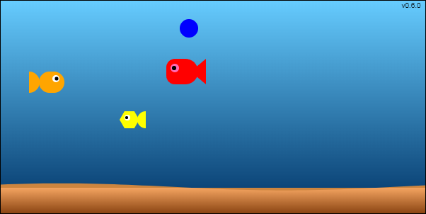

# ChatGPTPeli
Tämä peli on kehitetty ChatGPT-tekoälyn avulla tarkoituksena osallistua [Ohjelmointiputkan](https://www.ohjelmointiputka.net) järjestämään [ohjelmointi kilpailuun](https://www.ohjelmointiputka.net/kilpa.php?tunnus=2023-gptpeli). 

## Kalapeli

Pisteitä kerätään syömällä keltaisia kaloja (1p) sekä kuplia (3p).
Varo punaisia kaloja! Pelaa nuolinäppäimillä. Onnea peliin!

